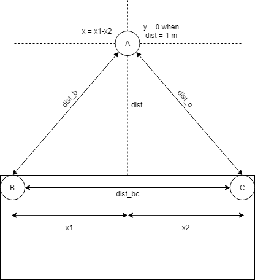
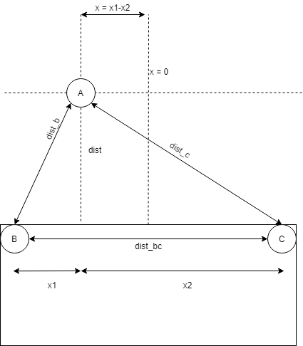

# Human Follower System Using DWM1000
 
This system is designed for a cart/mobile robot to be able to follow a user using a system of DWM1000 Ultra-Wideband modules.

The system enables two DWM1000 modules to be placed onto the cart, and one module to be placed onto a user. The two modules on the cart act as anchors while the other module act as a tag. Each module is connected to an Arduino module to execute the programs needed. The Arduinos attached to the anchors are then connected to a main Arduino board, which calculates the distance between the cart and the tag while also being responsible for moving the motors on the cart. The images below is a depiction of this.

.png)

### Distance is measured using a combination of Heron's formula and the formulas of the area of a triangle:

Heron’s Formula:
𝐴=√(𝑠(𝑠−𝑎)(𝑠−𝑏)(𝑠−𝑐)) where 𝑠=  (𝑎+𝑏+𝑐)/2 and 𝑎, 𝑏, & 𝑐 are the lengths of the sides of the triangle 
𝑎=𝑑𝑖𝑠𝑡_𝑏, 𝑏=𝑑𝑖𝑠𝑡_𝑐, and 𝑐=𝑑𝑖𝑠𝑡_𝑏𝑐
The x is calculated with conventional trigonometry.

