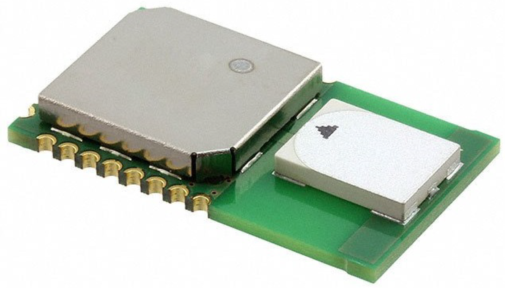
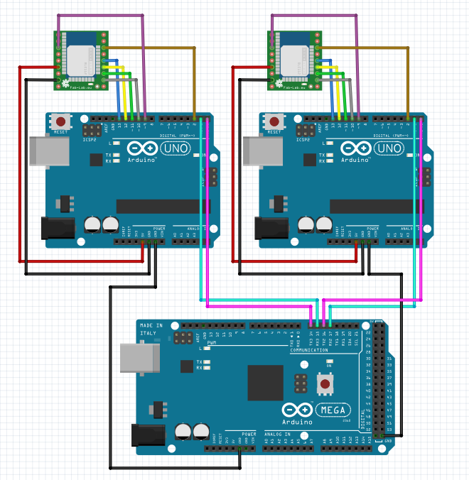

# Human Follower System Using DWM1000
 
This system is designed for a cart/mobile robot to be able to follow a user using a system of DWM1000 Ultra-Wideband modules.

The system enables two DWM1000 modules to be placed onto the cart, and one module to be placed onto a user. The two modules on the cart act as anchors while the other module act as a tag. Each module is connected to an Arduino module to execute the programs needed. The Arduinos attached to the anchors are then connected to a main Arduino board, which calculates the distance between the cart and the tag while also being responsible for moving the motors on the cart.

